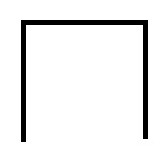
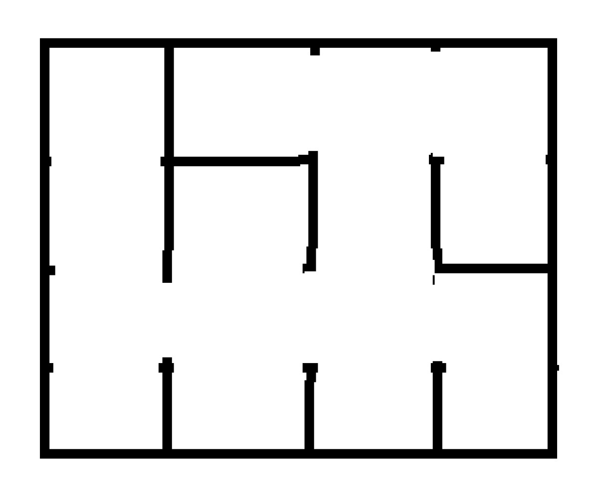
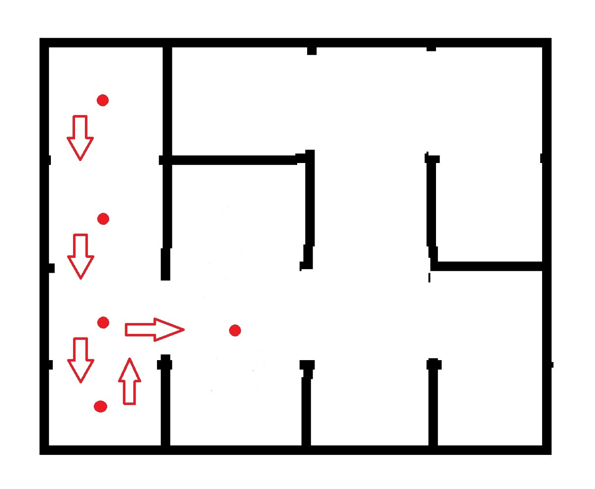

# Maze

## Background Information

In this project, we traverse through a square, *n x n* maze. This maze is represented by a series of 1's and 0's. For example, we look at the series 1011111010001001.
Every four digits represents a *1 x 1* square of the *n* matrix. Our series can be separated into 1011 1110 1000 1001. 


Each digit in the 4 sequence represents a side of the *1 x 1* square, in the order: North, South, West, East. 
If the value is 1, the path is blocked, if the value is 0, it is open.
For 1011, it would be: (1 - North), (0 - South), (1 - West), (1 - East), meaning it would be a box with the South side open. Like this:

<p align="center">
  
  
  
                           
</p>

And to provide further example, if the sequence for a maze looked like this:

<div align="center">

```
1011111010001001
0011101100110111
0010000000001001
0111011101110111
```
                           
</div>

Then the actual maze would be drawn like this: 

<p align = "center">



</p>

## Objective

The main objective of this lab is to traverse through the maze. We always start from the box at the top-left or North-West corner.

At each step, we need to check if there is an open path in the order: North, South, West, East, and we must take the first available opening. For instance, for a sequence 1001, we see that North is blocked because the value is 1. However, South and West has a value of 0, meaning we can either go South or West. Since South comes first in the order, we go South.

If we come to a dead end, without having traversed through all of the mazes, we must backtrack to our previous position and find a new path. Take a look at this example:  

<p align = "center">

</p>

We start from the very North-West box. Since the only opening is South, we go South. 

In the second box, we have two openings: North and South. If we go North, we would end up returning to our previous position, even though there are other available routes. Therefore, we cannot go North. Which means our only option is to go South. 

The third box has three openings: North, South, and East. Since we came from the North direction, we cannot go North. Therefore the first available opening is South.

In the fourth box, we have one single opening: North. We come to a dead end, therefore we backtrack to the previous direction we came from, which is North, and we return to the third box.

In the third box, since we have went South already, we have two remaining options: North and East. As stated, going North would return us to the previous position, even though there are other available routes. So we have to go East. 

Repeating this process, we must visit every box in the maze, **keeping track of every direction that we take** and once we have visited every box, we must traverse back to the starting point.

## Testing

In this program, we will be given *x* number of different mazes with the dimensions *n x n*. We must correctly traverse through all of the *x* number of mazes and find their paths from the starting point, visit all of the boxes, and back. 

Then we will compare all of the paths to find which pair of mazes has the least common subsequence.

In our input text files, the text files will include two numbers, each on the first two line. The first number represents the *x* number of mazes and the second number represents the *n*, the dimension of every maze. 

Our program will output the paths of each maze, the number of common subsequence for all pairs of mazes, and the pair with the least common subsequence. The output files will contain two numbers on the same line, which represents the correct pair of mazes with the least common subsequence.
